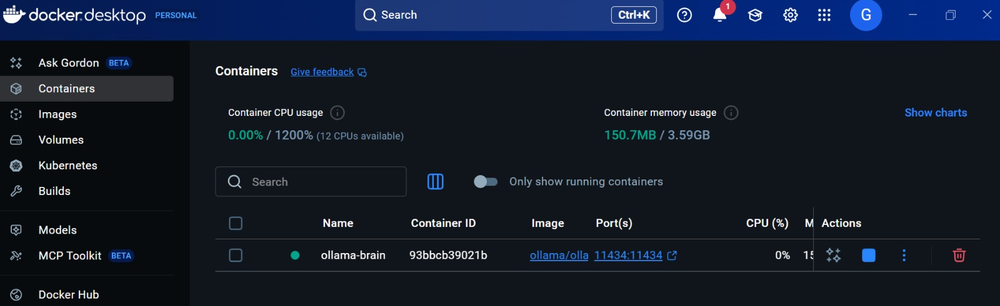
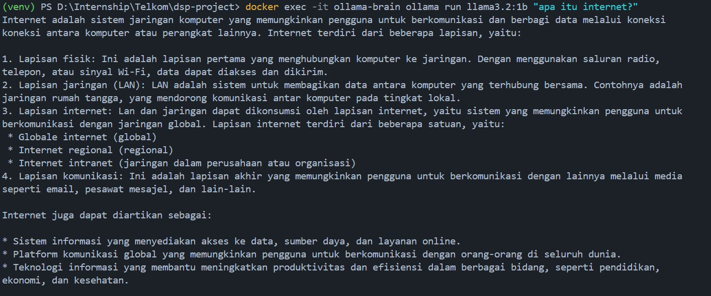
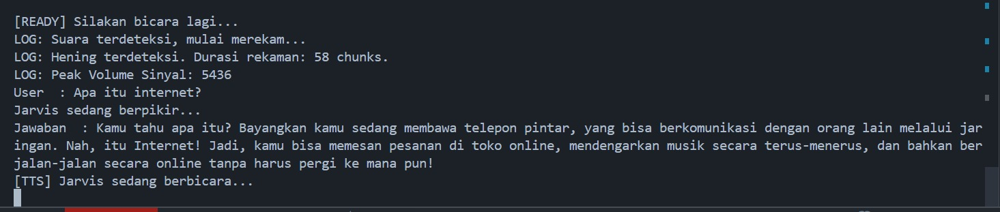

# Local Speech-to-Speech AI Assistant
---

## Pendahuluan

Implementasi asisten suara berbasis AI yang berjalan sepenuhnya secara lokal (On-Premise). Fokus utama adalah menjaga privasi data dan efisiensi *hardware* menggunakan teknik *quantization* pada model pendengaran (ASR) dan otak asisten (LLM).

## Arsitektur Sistem

Sistem dibangun dengan skema modular yang memisahkan tugas audio processing, logika, dan sintesis suara.

### Alur Logika (Logical Workflow)

---

## Implementasi Komponen Utama

Berikut adalah komponen teknis yang digunakan dalam proyek ini:

1. **ASR Engine**: Faster-Whisper (`base` model) dengan compute type `int8` untuk transkripsi cepat pada CPU.
2. **Brain Engine**: Ollama menggunakan model Llama 3.2 1B yang diisolasi di dalam container Docker.
3. **TTS Engine**: Library `pyttsx3` dengan driver SAPI5 Windows untuk respon suara lokal.

---

## Struktur Proyek

Pengorganisasian file dilakukan secara modular untuk memudahkan pemeliharaan dan pengembangan modul baru.

---

## Setup Lingkungan & Infrastruktur

### Infrastruktur Docker

Otak asisten (LLM) dijalankan melalui Docker Desktop untuk memastikan stabilitas dan isolasi resource.

### Model Management

Pengecekan ketersediaan model di dalam container untuk memastikan sistem siap menerima *request*.

---

## Hasil Pengujian Sistem

Sistem diuji dengan memberikan input suara secara langsung. Berikut adalah tampilan log interaksi yang menunjukkan proses transkripsi, berpikir, dan respon suara.

---

## Kesimpulan

Proyek ini berhasil membuktikan bahwa asisten suara yang cerdas dapat dijalankan pada *hardware* terbatas (CPU-only) dengan latensi yang dapat diterima, berkat penggunaan model yang dikuantisasi dan manajemen *container* yang baik.

---
## Repository & Kontak

- **GitHub Repository**: [github.com/gnieerfd/n8n-base-knowledge](https://github.com/gnieerfd/Local_Speech-to-Speech_AI-Assistant)
- **Author**: Gania Rafidah Huwaida

---
