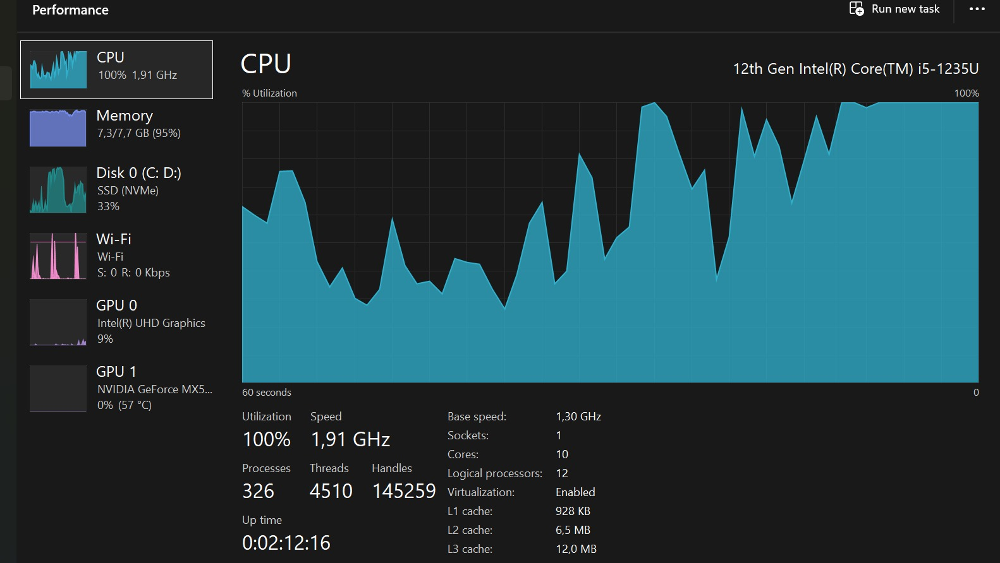

# Local Speech-to-Speech AI Assistant

## Pendahuluan

Implementasi asisten suara berbasis AI yang berjalan sepenuhnya secara lokal (On-Premise). Fokus utama adalah menjaga privasi data dan efisiensi *hardware* menggunakan teknik *quantization* pada model pendengaran (ASR) dan otak asisten (LLM).

## Arsitektur Sistem

Sistem dibangun dengan skema modular yang memisahkan tugas audio processing, logika, dan sintesis suara.

### Alur Logika (Logical Workflow)

---

## Implementasi Komponen Utama

Berikut adalah komponen teknis yang digunakan dalam proyek ini:

1. **ASR Engine**: Faster-Whisper (`base` model) dengan compute type `int8` untuk transkripsi cepat pada CPU.
2. **Brain Engine**: Ollama menggunakan model Llama 3.2 1B yang diisolasi di dalam container Docker.
3. **TTS Engine**: Library `pyttsx3` dengan driver SAPI5 Windows untuk respon suara lokal.

---

## Struktur Proyek

Pengorganisasian file dilakukan secara modular untuk memudahkan pemeliharaan dan pengembangan modul baru.

---

## Setup Lingkungan & Infrastruktur

### Infrastruktur Docker

Otak asisten (LLM) dijalankan melalui Docker Desktop untuk memastikan stabilitas dan isolasi resource.

### Model Management

Pengecekan ketersediaan model di dalam container untuk memastikan sistem siap menerima *request*.

---
## 💻 Testing Environment (Hardware Specs)

Sistem ini diuji menggunakan perangkat dengan spesifikasi berikut untuk mengukur latensi dan stabilitas pipeline STS:

* **Processor**: 12th Gen Intel(R) Core(TM) i5-1235U (10 Cores, 12 Logical Processors)
* **Memory**: 8.0 GB RAM DDR4 @3200 MT/s
* **GPU**: NVIDIA GeForce MX550 (Dedicated) & Intel(R) UHD Graphics
* **Storage**: SSD NVMe 
* **OS**: Windows 11 Home
---

## 📊 Monitoring Performa & Optimasi Resource

Menjalankan model ASR (Whisper) dan LLM (Llama) secara lokal pada hardware terbatas memerlukan manajemen resource yang ketat. Berikut adalah analisis beban kerja pada sistem:

### 1. Analisis Beban CPU (Stress Test)
Selama proses *inference* (berpikir), CPU Intel Core i5-1235U mencapai utilitas maksimal.

| Metrik | Nilai Pengujian | Analisis Teknik |
| :--- | :--- | :--- |
| **Utilitas CPU** | 100% (1.91 GHz) | Terjadi beban puncak saat kontainer Docker memproses teks. |
| **Total Threads** | 4.510 Threads | Sistem menangani 326 proses secara konkuren. |
| **Docker Load** | 709.77% CPU | Kontainer `ollama-brain` memeras seluruh *logical processors* yang tersedia. |

---

### 2. Status Memori/RAM: Kritis vs Teroptimasi
RAM 8GB adalah *bottleneck* utama. Tanpa optimasi, sistem akan mengalami *memory thrashing*.

#### 🔴 Kondisi Kritis (Tanpa Optimasi)
Saat menjalankan aplikasi berat (browser/Brave) bersamaan dengan Jarvis:
- **Penggunaan RAM**: 94-95% (7.3/7.7 GB).
- **Available RAM**: Hanya tersisa **522 MB**.
- **Committed Memory**: Membengkak hingga **18.4 GB**, memaksa SSD bekerja sebagai *virtual memory* (Pagefile) yang memperlambat respon.

#### 🟢 Kondisi Teroptimasi (Setelah Kalibrasi)
Setelah menutup aplikasi non-esensial dan melakukan *clean setup*:
- **Penggunaan RAM**: Stabil di angka **76%**.
- **Resource Terbesar**: `VmmemWSL` (Docker) menggunakan **457.2 MB**.
- **Sektor Efisiensi**: VS Code dikurangi bebannya hingga hanya memakan **409.3 MB**.

---

## Hasil Pengujian Sistem

Sistem diuji dengan memberikan input suara secara langsung. Berikut adalah tampilan log interaksi yang menunjukkan proses transkripsi, berpikir, dan respon suara.

---

## Kesimpulan

Proyek ini berhasil membuktikan bahwa asisten suara yang cerdas dapat dijalankan pada *hardware* terbatas (CPU-only) dengan latensi yang dapat diterima, berkat penggunaan model yang dikuantisasi dan manajemen *container* yang baik.

---
## Repository & Kontak

- **GitHub Repository**: [github.com/gnieerfd/Local_Speech-to-Speech_AI-Assistant](https://github.com/gnieerfd/Local_Speech-to-Speech_AI-Assistant)
- **Author**: Gania Rafidah Huwaida

---
